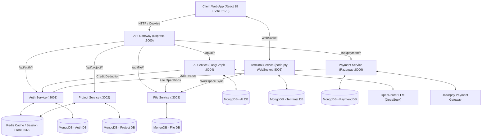

# ⚡ VertexAI — Next-Gen Cloud Code Editor & Agentic AI Workspace

<p align="center">
  
  
  
  
  
  
  
  
  
</p>

A state-of-the-art, full-stack cloud code editor and IDE built on an enterprise **Microservices Architecture**. Features Firebase Google authentication, Redis distributed session management, a multi-tab syntax-highlighted code editor, file tree hierarchy, live HTML/React preview, real-time WebSocket interactive terminal powered by `node-pty`, automated Razorpay payment subscriptions, and an autonomous **Agentic AI Assistant** powered by LangGraph that can directly inspect, create, update, and delete files inside your project.

---

## 📑 Table of Contents

- [System Architecture](#-system-architecture)
- [Key Features](#-key-features)
- [Microservices Overview](#-microservices-overview)
- [User Workflow](#-user-workflow)
- [Tech Stack](#-tech-stack)
- [Repository Structure](#-repository-structure)
- [Getting Started & Local Setup](#-getting-started--local-setup)
  - [Prerequisites](#prerequisites)
  - [1. Clone Repository](#1-clone-repository)
  - [2. Environment Configuration](#2-environment-configuration)
  - [3. Install Dependencies](#3-install-dependencies)
  - [4. Run All Services (1-Click or Manual)](#4-run-all-services)
- [API Reference](#-api-reference)
- [Security & Environment Hardening](#-security--environment-hardening)
- [License](#-license)

---

## 🏗 System Architecture

The platform is designed around a decoupled, fault-tolerant microservice architecture orchestrated via a centralized **API Gateway**:



---

## ✨ Key Features

### 🤖 Agentic AI Assistant (LangGraph + OpenRouter)
- **Autonomous Filesystem Tools**: The AI doesn't just write snippets; it directly executes filesystem actions (`get_tree`, `create_file`, `update_file`, `delete_file`, `create_folder`, `get_file`) to build full working projects.
- **Server-Sent Events (SSE) Streaming**: Real-time token streaming with live tool badge notifications in the chat interface.
- **Credit-Based Execution**: Integrated credit accounting with automatic pre-checks and deduction per AI task.

### 🖥️ Interactive Web Terminal (WebSocket + node-pty)
- **Real-Time Shell Execution**: Powered by `node-pty` and `xterm.js`, spawning PowerShell on Windows and Bash on Linux.
- **Workspace Syncing**: Project files are automatically extracted into an isolated workspace directory before launching the terminal.
- **Dynamic Resizing**: Bidirectional terminal dimension synchronization and ANSI color support.

### 💳 Plans & Razorpay Payment Integration
- **Subscription Tiers**: Free (100 credits), Pro (500 credits @ ₹299), and Team (2,000 credits @ ₹799).
- **Secure Payments**: Razorpay order generation and HMAC SHA256 cryptographic signature verification.
- **Automated Credit Top-Up**: Automatically increments user credit balance upon successful transaction verification.

### 🔐 Authentication & Session Security
- **Firebase Google Sign-In**: Client-side OAuth authentication with backend token verification via Firebase Admin SDK.
- **Distributed Redis Sessions**: Session tokens stored with automatic TTL expiration.
- **HTTP-Only Cookies**: Protection against XSS and session hijacking.

### 💻 Rich IDE Workspace (`/project/:id`)
- **Multi-Tab Code Editor**: Syntax-highlighted code editing with active tab tracking and clean file switching.
- **Interactive File Explorer**: Full hierarchical folder and file management.
- **Live Preview Pane**: Real-time HTML/JS and React iframe preview with fullscreen support.
- **Bottom Panel**: Expandable, collapsible terminal console.

---

## 🧩 Microservices Overview

| Microservice | Port | Description | Database / Cache |
| :--- | :--- | :--- | :--- |
| **API Gateway** | `3000` | Reverse proxy routing, CORS handling, cookie session extraction, and user injection | Redis |
| **Auth Service** | `3001` | Firebase OAuth verification, user profiles, session storage, credit management | MongoDB (`/auth`), Redis |
| **Project Service** | `3002` | Project CRUD, starring, metadata management, and recent project caching | MongoDB (`/project`), Redis |
| **File Service** | `3003` | Recursive tree builder, file/folder CRUD, and soft-delete cascading | MongoDB (`/file`), Redis |
| **AI Service** | `8004` | LangGraph agentic workflow, OpenRouter DeepSeek integration, SSE streaming | MongoDB (`/ai`) |
| **Terminal Service** | `8005` | WebSocket terminal server, `node-pty` shell spawning, project workspace sync | MongoDB (`/terminal`) |
| **Payment Service** | `8006` | Razorpay order creation, payment signature verification, credit top-up | MongoDB (`/payment`) |
| **Frontend Client** | `5173` | React 18, Vite, Redux Toolkit, Tailwind CSS, Framer Motion, XTerm.js | Browser LocalStorage |

---

## 🛠 Tech Stack

| Domain | Technologies & Libraries |
| :--- | :--- |
| **Frontend** | React 18, Vite, Redux Toolkit, Framer Motion, Lucide React, Axios, XTerm.js (`@xterm/xterm`), React Router v6 |
| **Styling** | Vanilla CSS, Tailwind CSS utilities, Modern Glassmorphism & Dark Mode Tokens |
| **API Gateway** | Express.js, `express-http-proxy`, CORS, Cookie Parser, Dotenv |
| **AI & LLM** | `@langchain/langgraph`, `@langchain/openrouter`, `@langchain/core`, DeepSeek Chat |
| **Terminal** | `node-pty`, `socket.io`, `socket.io-client`, XTerm Fit Addon |
| **Payments** | Razorpay SDK, Crypto (HMAC SHA256) |
| **Databases & Cache** | MongoDB Atlas, Redis (`ioredis`) |
| **Authentication** | Firebase Admin SDK, Firebase Client SDK, Crypto UUID |
| **DevOps** | Docker, Docker Compose, Windows Batch Scripting |

---

## 📁 Repository Structure

```text
AI_Code_Editor/
├── .env.example                     # Master environment variable template
├── .gitignore                       # Master gitignore protecting credentials & builds
├── README.md                        # Documentation & setup guide
├── start-dev.bat                    # 1-Click launcher for all services on Windows
├── backend/
│   ├── docker-compose.yml           # Redis container orchestration
│   ├── package.json
│   ├── gateway/                     # API Gateway (Port 3000)
│   │   ├── index.js                 # Proxy routes (/api/auth, /api/project, /api/file, /api/ai, /api/payment)
│   │   ├── .env.example
│   │   └── package.json
│   ├── services/
│   │   ├── auth/                    # Auth Service (Port 3001)
│   │   │   ├── controllers/         # Login, logout, getMe, credits
│   │   │   ├── models/              # User Schema
│   │   │   └── routes/
│   │   ├── project/                 # Project Service (Port 3002)
│   │   │   ├── controllers/         # Project CRUD & starring
│   │   │   ├── models/              # Project Schema
│   │   │   └── routes/
│   │   ├── file/                    # File Service (Port 3003)
│   │   │   ├── controllers/         # File tree & file operations
│   │   │   ├── models/              # File Schema
│   │   │   └── utils/               # Recursive tree builder
│   │   ├── ai/                      # AI Service (Port 8004)
│   │   │   ├── controllers/         # SSE streaming chat controller
│   │   │   ├── graph/               # LangGraph workflow & filesystem tools
│   │   │   └── utils/               # LLM client & credit deduction
│   │   ├── terminal/                # Terminal Service (Port 8005)
│   │   │   └── index.js             # WebSocket server & node-pty shell
│   │   └── payment/                 # Payment Service (Port 8006)
│   │       ├── controllers/         # Razorpay orders & verification
│   │       ├── models/              # Payment Schema
│   │       └── routes/
│   └── shared/                      # Shared modules
│       └── redis/                   # Centralized Redis connection client
└── frontend/                        # React + Vite Client (Port 5173)
    ├── index.html                   # HTML template with Razorpay Checkout SDK
    ├── vite.config.js
    └── src/
        ├── components/              # ActivityBar, Editor, Explorer, AiChat, Terminal, etc.
        ├── features/                # Axios API callers (auth, project, file, payment)
        ├── pages/                   # Dashboard, ProjectPage, Plan
        └── redux/                   # Redux slices (userSlice, projectSlice)
```

---

## 🚀 Getting Started & Local Setup

### Prerequisites
- [Node.js](https://nodejs.org/) (v18 or higher)
- [Docker Desktop](https://www.docker.com/products/docker-desktop/) (for Redis)
- [MongoDB Atlas](https://www.mongodb.com/cloud/atlas) account
- [OpenRouter API Key](https://openrouter.ai/settings/keys)
- [Razorpay Test Account](https://dashboard.razorpay.com/) (optional, for payments)
- [Firebase Console](https://console.firebase.google.com/) project with Google Auth enabled

---

### 1. Clone Repository

```bash
git clone https://github.com/parvezs2442/AI_Code_Editor.git
cd AI_Code_Editor
```

---

### 2. Environment Configuration

Create `.env` files in each service directory using the provided `.env.example` templates:

#### A. Gateway (`backend/gateway/.env`)
```env
PORT=3000
AUTH_URL=http://localhost:3001
PROJECT_URL=http://localhost:3002
FILE_URL=http://localhost:3003
AI_URL=http://localhost:8004
PAYMENT_URL=http://localhost:8006
TERMINAL_URL=http://localhost:8005
REDIS_URL=redis://localhost:6379
```

#### B. Auth Service (`backend/services/auth/.env`)
```env
PORT=3001
MONGODB_URI=mongodb+srv://<user>:<password>@cluster.mongodb.net/auth
REDIS_URL=redis://localhost:6379
NODE_ENV=development
```

#### C. Project Service (`backend/services/project/.env`)
```env
PORT=3002
MONGODB_URI=mongodb+srv://<user>:<password>@cluster.mongodb.net/project
REDIS_URL=redis://localhost:6379
JWT_SECRET=your_jwt_secret_key
```

#### D. File Service (`backend/services/file/.env`)
```env
PORT=3003
MONGODB_URI=mongodb+srv://<user>:<password>@cluster.mongodb.net/file
REDIS_URL=redis://localhost:6379
```

#### E. AI Service (`backend/services/ai/.env`)
```env
PORT=8004
MONGODB_URI=mongodb+srv://<user>:<password>@cluster.mongodb.net/ai
REDIS_URL=redis://localhost:6379
FILE_SERVICE_URL=http://localhost:3003
AUTH_SERVICE=http://localhost:3001
AI_MODEL=deepseek/deepseek-chat
OPENROUTER_API_KEY=sk-or-v1-your_openrouter_api_key_here
```

#### F. Terminal Service (`backend/services/terminal/.env`)
```env
PORT=8005
MONGODB_URI=mongodb+srv://<user>:<password>@cluster.mongodb.net/terminal
FILE_SERVICE_URL=http://localhost:3003
REDIS_URL=redis://localhost:6379
```

#### G. Payment Service (`backend/services/payment/.env`)
```env
PORT=8006
MONGODB_URI=mongodb+srv://<user>:<password>@cluster.mongodb.net/payment
REDIS_URL=redis://localhost:6379
RAZORPAY_KEY_ID=your_razorpay_test_key_id
RAZORPAY_KEY_SECRET=your_razorpay_test_key_secret
AUTH_SERVICE=http://localhost:3001
```

#### H. Frontend Client (`frontend/.env`)
```env
VITE_SERVER_URL=http://localhost:3000
VITE_TERMINAL_SERVICE_URL=http://localhost:8005
VITE_FIREBASE_API_KEY=your_firebase_api_key
```

---

### 3. Install Dependencies

```bash
# Gateway
cd backend/gateway && npm install

# Microservices
cd ../services/auth && npm install
cd ../project && npm install
cd ../file && npm install
cd ../ai && npm install
cd ../terminal && npm install
cd ../payment && npm install

# Frontend
cd ../../../frontend && npm install
```

---

### 4. Run All Services

#### Option A: 1-Click Startup (Windows)
Double-click **`start-dev.bat`** in the project root. It will automatically start Redis in Docker and launch all 8 services in dedicated terminal windows!

#### Option B: Manual Startup
Open separate terminal tabs for each service:
1. **Redis**: `cd backend && docker compose up -d`
2. **Gateway**: `cd backend/gateway && npm run dev`
3. **Auth**: `cd backend/services/auth && npm run dev`
4. **Project**: `cd backend/services/project && npm run dev`
5. **File**: `cd backend/services/file && npm run dev`
6. **AI**: `cd backend/services/ai && npm run dev`
7. **Terminal**: `cd backend/services/terminal && npm run dev`
8. **Payment**: `cd backend/services/payment && npm run dev`
9. **Frontend**: `cd frontend && npm run dev`

Open your browser at **`http://localhost:5173`** to access the IDE!

---

## 📡 API Reference

All client HTTP requests route through the **API Gateway** on port `3000`:

| Service | Method | Endpoint | Description |
| :--- | :--- | :--- | :--- |
| **Auth** | `POST` | `/api/auth/login` | Authenticate with Firebase ID token & set cookie |
| **Auth** | `GET` | `/api/auth/me` | Fetch current user profile & credit balance |
| **Auth** | `GET` | `/api/auth/logout` | Revoke session & clear cookie |
| **Auth** | `POST` | `/api/auth/user/deduct-credits` | Deduct credits for AI requests |
| **Auth** | `POST` | `/api/auth/user/add-credits` | Add credits after payment verification |
| **Project** | `GET` | `/api/project/` | List all user projects |
| **Project** | `POST` | `/api/project/` | Create a new project |
| **Project** | `GET` | `/api/project/:id` | Get project details by ID |
| **Project** | `PATCH` | `/api/project/:id` | Toggle star status |
| **Project** | `DELETE` | `/api/project/:id` | Delete a project |
| **File** | `GET` | `/api/file/tree/:projectId` | Fetch project directory tree hierarchy |
| **File** | `POST` | `/api/file/create-file` | Create a new file |
| **File** | `POST` | `/api/file/create-folder` | Create a new folder |
| **File** | `GET` | `/api/file/:id` | Fetch file content |
| **File** | `POST` | `/api/file/update/:id` | Update file content or rename |
| **File** | `DELETE` | `/api/file/:id` | Delete a file or folder |
| **AI** | `POST` | `/api/ai/chat` | Server-Sent Events (SSE) AI coding stream |
| **Terminal** | `WS` | `ws://localhost:8005` | WebSocket shell session (`terminal:init`, `terminal:write`) |
| **Payment** | `POST` | `/api/payment/create` | Create a Razorpay checkout order |
| **Payment** | `POST` | `/api/payment/verify` | Verify Razorpay HMAC signature & credit top-up |

---

## 🔒 Security & Environment Hardening

- **Zero Hardcoded Secrets**: All keys, database credentials, and secrets are strictly loaded through `.env` configurations.
- **Git Ignore Protection**: Master [.gitignore](file:///d:/CodeEditor/.gitignore) prevents any `.env`, `.key`, or credential artifacts from being tracked.
- **Session Protection**: Distributed Redis sessions with HTTP-only cookies prevent XSS exploitation and token leakage.
- **HMAC Payment Verification**: Cryptographically verifies Razorpay payment signatures with server-side secrets before fulfilling credits.

---

## 📄 License

This project is licensed under the [ISC License](LICENSE).
